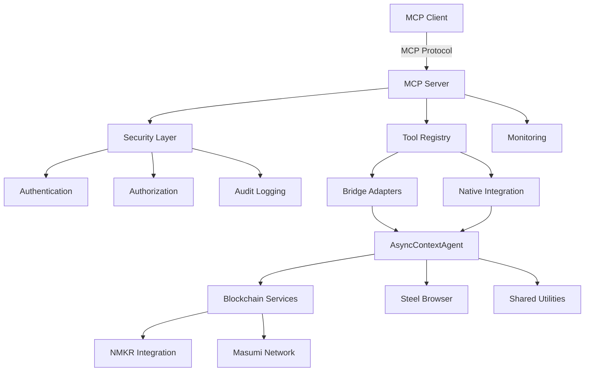
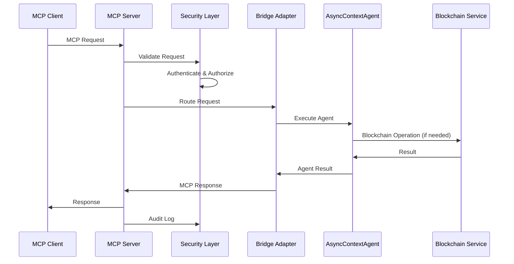
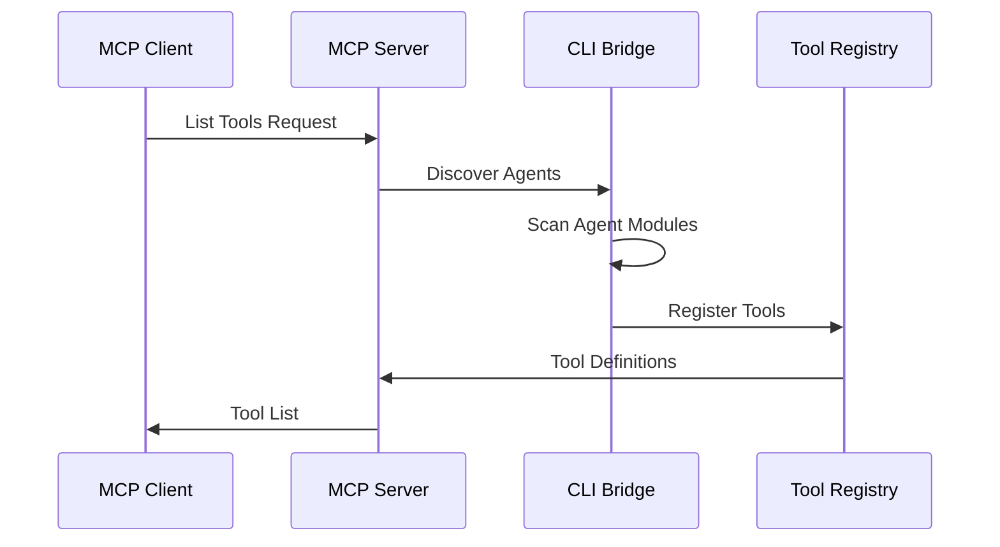
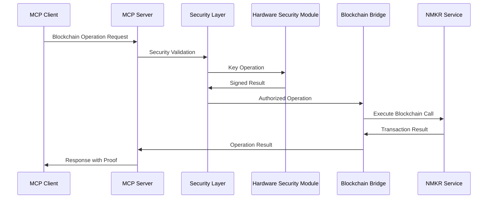
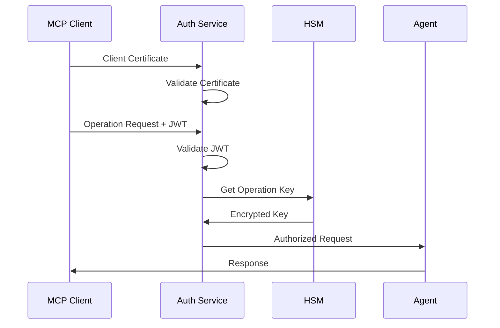

# Agent Forge MCP Technical Architecture

## Overview

This document defines the technical architecture for integrating Model Context Protocol (MCP) support into Agent Forge, enabling the framework's blockchain-enhanced AI agents to participate in Anthropic's ecosystem while maintaining production-grade reliability and security.

**Architecture Goals**:
- Preserve Agent Forge's AsyncContextAgent foundation and performance characteristics
- Enable secure exposure of blockchain capabilities (NMKR, Masumi Network) through MCP
- Maintain backward compatibility with existing CLI and API interfaces
- Achieve <10% performance overhead for MCP operations
- Support enterprise-grade security, monitoring, and compliance requirements

---

## High-Level Architecture

### System Overview
```
┌─────────────────────────────────────────────────────────────────┐
│                    Agent Forge MCP Integration                  │
├─────────────────────────────────────────────────────────────────┤
│  MCP Clients (Claude Desktop, Third-Party)                     │
├─────────────────────────────────────────────────────────────────┤
│  MCP Protocol Layer                                            │
│  ├── Protocol Handler      ├── Security Layer                  │
│  ├── Tool Registry        ├── Monitoring                      │
│  └── Resource Manager     └── Audit Logging                   │
├─────────────────────────────────────────────────────────────────┤
│  Integration Layer                                             │
│  ├── Bridge Adapters      ├── Native MCP Support              │
│  ├── CLI Interface Bridge ├── AsyncContextAgent Enhancement    │
│  └── Blockchain Bridge    └── Performance Optimization         │
├─────────────────────────────────────────────────────────────────┤
│  Agent Forge Core                                             │
│  ├── AsyncContextAgent    ├── Blockchain Integration           │
│  ├── CLI Interface        ├── NMKR Proof-of-Execution         │
│  ├── Testing Framework    ├── Masumi Network                  │
│  └── Steel Browser        └── Shared Utilities                │
└─────────────────────────────────────────────────────────────────┘
```

### Component Interactions


---

## Component Architecture

### 1. MCP Protocol Layer

#### MCP Server Core
**Responsibility**: Handle MCP protocol compliance and client communication

```python
class MCPServer:
    """Core MCP server implementation for Agent Forge."""
    
    def __init__(self, config: MCPServerConfig):
        self.protocol_handler = MCPProtocolHandler()
        self.tool_registry = ToolRegistry()
        self.resource_manager = ResourceManager()
        self.security_layer = SecurityLayer(config.security)
        self.monitor = MCPMonitor()
        
    async def handle_request(self, request: MCPRequest) -> MCPResponse:
        """Handle incoming MCP requests with security and monitoring."""
        # Security validation
        await self.security_layer.validate_request(request)
        
        # Route to appropriate handler
        if request.type == "tool":
            return await self.handle_tool_request(request)
        elif request.type == "resource":
            return await self.handle_resource_request(request)
        
        # Monitor and audit
        await self.monitor.log_request(request, response)
        return response
```

#### Protocol Handler
**Responsibility**: MCP specification compliance and message processing

```python
class MCPProtocolHandler:
    """Handles MCP protocol specification compliance."""
    
    async def validate_message(self, message: MCPMessage) -> bool:
        """Validate message format against MCP specification."""
        pass
        
    async def serialize_response(self, response: Any) -> MCPMessage:
        """Serialize Agent Forge responses to MCP format."""
        pass
        
    async def deserialize_request(self, message: MCPMessage) -> MCPRequest:
        """Parse MCP requests into Agent Forge format."""
        pass
```

### 2. Integration Layer

#### Bridge Adapters (Phase 1 Implementation)
**Responsibility**: Translate between Agent Forge and MCP interfaces

```python
class AsyncContextAgentBridge:
    """Bridge adapter for AsyncContextAgent to MCP Tool interface."""
    
    def __init__(self, agent: AsyncContextAgent):
        self.agent = agent
        self.config = agent.config
        
    async def to_mcp_tool(self) -> MCPTool:
        """Convert AsyncContextAgent to MCP Tool definition."""
        return MCPTool(
            name=self.agent.name,
            description=self.agent.__doc__ or f"Agent Forge {self.agent.name}",
            parameters=self._extract_parameters(),
            handler=self._create_handler()
        )
        
    async def execute_via_mcp(self, params: Dict[str, Any]) -> MCPResult:
        """Execute agent through MCP interface."""
        # Map MCP parameters to agent format
        agent_params = self._map_parameters(params)
        
        # Execute agent with context preservation
        async with self.agent as agent_context:
            result = await agent_context.run(**agent_params)
            
        # Convert result to MCP format
        return self._format_mcp_result(result)
```

#### CLI Interface Bridge
**Responsibility**: Expose CLI-discovered agents through MCP

```python
class CLIBridge:
    """Bridge for exposing CLI-discovered agents via MCP."""
    
    def __init__(self, cli_manager: CLIManager):
        self.cli_manager = cli_manager
        
    async def discover_agents(self) -> List[MCPTool]:
        """Discover all CLI-available agents and convert to MCP tools."""
        agents = await self.cli_manager.discover_agents()
        mcp_tools = []
        
        for agent_class in agents:
            bridge = AsyncContextAgentBridge(agent_class())
            tool = await bridge.to_mcp_tool()
            mcp_tools.append(tool)
            
        return mcp_tools
```

#### Blockchain Operations Bridge
**Responsibility**: Secure exposure of blockchain capabilities

```python
class BlockchainBridge:
    """Secure bridge for blockchain operations via MCP."""
    
    def __init__(self, security_config: BlockchainSecurityConfig):
        self.nmkr_client = NMKRClient()
        self.masumi_client = MasumiClient()
        self.security = BlockchainSecurity(security_config)
        
    async def create_proof_tool(self) -> MCPTool:
        """Create MCP tool for NMKR proof generation."""
        return MCPTool(
            name="nmkr_proof_generation",
            description="Generate NMKR Proof-of-Execution NFT",
            parameters=self._proof_parameters(),
            handler=self._secure_proof_handler(),
            security_tier=SecurityTier.FINANCIAL
        )
        
    async def _secure_proof_handler(self, params: Dict[str, Any]) -> MCPResult:
        """Secure handler for proof generation with HSM integration."""
        # Validate security context
        await self.security.validate_financial_operation(params)
        
        # Generate proof with audit logging
        with self.security.audit_context("nmkr_proof_generation"):
            proof = await self.nmkr_client.generate_proof(params)
            
        return MCPResult(success=True, data=proof)
```

### 3. Native MCP Integration (Phase 2+ Implementation)

#### Enhanced AsyncContextAgent
**Responsibility**: Native MCP support in Agent Forge core

```python
class AsyncContextAgentMCP(AsyncContextAgent):
    """AsyncContextAgent with native MCP support."""
    
    def __init__(self, name: str = None, config: dict = None, mcp_config: MCPConfig = None):
        super().__init__(name, config)
        self.mcp_config = mcp_config or MCPConfig()
        self.mcp_tools = []
        self.mcp_resources = []
        
    async def register_mcp_tool(self, tool_def: MCPToolDefinition):
        """Register this agent as an MCP tool."""
        self.mcp_tools.append(tool_def)
        
    async def provide_mcp_resource(self, resource_def: MCPResourceDefinition):
        """Provide resources accessible via MCP."""
        self.mcp_resources.append(resource_def)
        
    async def execute_mcp_request(self, request: MCPRequest) -> MCPResponse:
        """Handle MCP requests natively within agent context."""
        # Preserve async context and error handling
        try:
            result = await self._handle_mcp_request_internal(request)
            return MCPResponse(success=True, result=result)
        except Exception as e:
            self.logger.error(f"MCP request failed: {e}")
            return MCPResponse(success=False, error=str(e))
```

### 4. Security Architecture

#### Multi-Tier Security Model
**Responsibility**: Graduated security controls based on operation risk

```python
class SecurityLayer:
    """Multi-tier security implementation for MCP operations."""
    
    def __init__(self, config: SecurityConfig):
        self.auth_service = AuthenticationService()
        self.authz_engine = AuthorizationEngine()
        self.audit_logger = AuditLogger()
        self.hsm_client = HSMClient() if config.use_hsm else None
        
    async def validate_request(self, request: MCPRequest) -> SecurityContext:
        """Validate request and establish security context."""
        # Determine operation security tier
        tier = self._classify_operation(request)
        
        # Apply appropriate authentication
        auth_context = await self._authenticate_request(request, tier)
        
        # Check authorization
        await self._authorize_operation(request, auth_context, tier)
        
        # Create security context
        return SecurityContext(
            tier=tier,
            auth_context=auth_context,
            audit_id=await self.audit_logger.start_audit(request)
        )
        
    def _classify_operation(self, request: MCPRequest) -> SecurityTier:
        """Classify operation risk level."""
        if request.involves_blockchain_write():
            return SecurityTier.FINANCIAL
        elif request.involves_sensitive_data():
            return SecurityTier.MEDIUM
        else:
            return SecurityTier.LOW
```

#### Hardware Security Module Integration
**Responsibility**: Secure key management and transaction signing

```python
class HSMClient:
    """Hardware Security Module interface for blockchain operations."""
    
    async def sign_transaction(self, transaction: Transaction, key_id: str) -> Signature:
        """Sign blockchain transaction using HSM-protected keys."""
        pass
        
    async def generate_proof_signature(self, proof_data: bytes) -> Signature:
        """Generate cryptographic signature for proof verification."""
        pass
        
    async def encrypt_sensitive_data(self, data: bytes, key_id: str) -> bytes:
        """Encrypt sensitive data using HSM-managed keys."""
        pass
```

### 5. Performance Architecture

#### Caching Layer
**Responsibility**: Optimize repeated operations and reduce latency

```python
class MCPCacheManager:
    """Intelligent caching for MCP operations."""
    
    def __init__(self, config: CacheConfig):
        self.agent_cache = AgentResultCache()
        self.tool_cache = ToolDefinitionCache()
        self.resource_cache = ResourceCache()
        
    async def get_cached_result(self, request: MCPRequest) -> Optional[MCPResponse]:
        """Retrieve cached result if available and valid."""
        cache_key = self._generate_cache_key(request)
        
        if self._is_cacheable(request):
            return await self.agent_cache.get(cache_key)
            
        return None
        
    async def cache_result(self, request: MCPRequest, response: MCPResponse):
        """Cache response with appropriate TTL."""
        if self._should_cache(request, response):
            cache_key = self._generate_cache_key(request)
            ttl = self._determine_ttl(request)
            await self.agent_cache.set(cache_key, response, ttl)
```

#### Connection Pooling
**Responsibility**: Efficient resource management for concurrent operations

```python
class MCPConnectionPool:
    """Connection pool for MCP client management."""
    
    def __init__(self, max_connections: int = 100):
        self.pool = asyncio.Queue(maxsize=max_connections)
        self.active_connections = {}
        
    async def get_connection(self, client_id: str) -> MCPConnection:
        """Get connection from pool or create new one."""
        pass
        
    async def return_connection(self, connection: MCPConnection):
        """Return connection to pool for reuse."""
        pass
```

### 6. Monitoring and Observability

#### Performance Monitoring
**Responsibility**: Real-time performance tracking and alerting

```python
class MCPMonitor:
    """Comprehensive monitoring for MCP operations."""
    
    def __init__(self, config: MonitoringConfig):
        self.metrics_collector = MetricsCollector()
        self.alert_manager = AlertManager()
        self.dashboard = MonitoringDashboard()
        
    async def track_request(self, request: MCPRequest, start_time: float):
        """Track request performance metrics."""
        duration = time.time() - start_time
        
        await self.metrics_collector.record_latency(
            operation=request.operation,
            duration=duration,
            tags={"client": request.client_id, "tier": request.security_tier}
        )
        
        # Check for performance degradation
        if duration > self.config.latency_threshold:
            await self.alert_manager.send_alert(
                AlertType.PERFORMANCE_DEGRADATION,
                f"High latency detected: {duration}ms"
            )
```

#### Health Checks
**Responsibility**: System health validation and automatic recovery

```python
class MCPHealthChecker:
    """Health checking for MCP infrastructure."""
    
    async def check_system_health(self) -> HealthStatus:
        """Comprehensive health check of MCP components."""
        checks = [
            self._check_mcp_server(),
            self._check_agent_availability(),
            self._check_blockchain_connectivity(),
            self._check_security_services(),
            self._check_performance_metrics()
        ]
        
        results = await asyncio.gather(*checks, return_exceptions=True)
        return self._aggregate_health_status(results)
```

---

## Data Flow Architecture

### Request Processing Flow


### Agent Discovery Flow


### Blockchain Operation Flow


---

## Performance Specifications

### Latency Targets
| Operation Type | Target Latency | Maximum Latency |
|----------------|----------------|-----------------|
| Tool Discovery | <100ms | <500ms |
| Simple Agent Execution | <2s | <10s |
| Blockchain Read Operation | <500ms | <2s |
| Blockchain Write Operation | <5s | <30s |
| Resource Access | <200ms | <1s |

### Throughput Targets
| Metric | Target | Maximum Load |
|--------|--------|--------------|
| Concurrent Clients | 1000 | 5000 |
| Requests per Second | 500 | 2000 |
| Agent Executions per Minute | 1000 | 5000 |
| Blockchain Operations per Hour | 100 | 500 |

### Resource Utilization
| Resource | Normal Load | Peak Load |
|----------|-------------|-----------|
| CPU Usage | <50% | <80% |
| Memory Usage | <2GB | <8GB |
| Network Bandwidth | <100Mbps | <1Gbps |
| Storage I/O | <1000 IOPS | <5000 IOPS |

---

## Deployment Architecture

### Infrastructure Components
```
Production Deployment
├── Load Balancer (HAProxy/NGINX)
├── MCP Server Cluster (3+ instances)
│   ├── MCP Protocol Layer
│   ├── Security Services
│   └── Monitoring Agents
├── Caching Layer (Redis Cluster)
├── Database Cluster (PostgreSQL)
├── HSM Service (Hardware Security Module)
└── Monitoring Stack
    ├── Prometheus (Metrics)
    ├── Grafana (Dashboards)
    ├── ELK Stack (Logging)
    └── AlertManager (Alerting)
```

### Container Architecture
```dockerfile
# MCP Server Container
FROM python:3.11-slim
COPY agent_forge/ /app/agent_forge/
COPY mcp_server/ /app/mcp_server/
WORKDIR /app
RUN pip install -r requirements.txt
CMD ["python", "-m", "mcp_server.main"]
```

### Kubernetes Deployment
```yaml
apiVersion: apps/v1
kind: Deployment
metadata:
  name: agent-forge-mcp-server
spec:
  replicas: 3
  selector:
    matchLabels:
      app: agent-forge-mcp
  template:
    metadata:
      labels:
        app: agent-forge-mcp
    spec:
      containers:
      - name: mcp-server
        image: agentforge/mcp-server:latest
        ports:
        - containerPort: 8080
        env:
        - name: MCP_SERVER_CONFIG
          valueFrom:
            configMapKeyRef:
              name: mcp-config
              key: server.yaml
        resources:
          requests:
            memory: "512Mi"
            cpu: "250m"
          limits:
            memory: "2Gi"
            cpu: "1000m"
```

---

## Security Architecture Details

### Authentication Flow


### Authorization Matrix
| Operation | MCP Client Auth | User Auth | Financial Auth | Admin Auth |
|-----------|----------------|-----------|----------------|------------|
| List Tools | Required | - | - | - |
| Execute Read-Only Agent | Required | Required | - | - |
| Execute Agent with Blockchain Read | Required | Required | - | - |
| Execute NMKR Proof Generation | Required | Required | Required | - |
| Execute Payment Operations | Required | Required | Required | - |
| Modify System Configuration | Required | Required | Required | Required |

---

## Testing Architecture

### Test Categories
1. **Protocol Compliance Tests**: MCP specification adherence
2. **Performance Tests**: Latency, throughput, resource utilization
3. **Security Tests**: Authentication, authorization, audit logging
4. **Integration Tests**: End-to-end workflows with Claude Desktop
5. **Blockchain Tests**: NMKR and Masumi integration validation
6. **Chaos Engineering**: Resilience and recovery testing

### Test Infrastructure
```python
class MCPTestSuite:
    """Comprehensive test suite for MCP integration."""
    
    async def test_protocol_compliance(self):
        """Test MCP protocol specification compliance."""
        pass
        
    async def test_performance_benchmarks(self):
        """Validate performance targets and SLAs."""
        pass
        
    async def test_security_controls(self):
        """Validate all security controls and audit trails."""
        pass
        
    async def test_blockchain_integration(self):
        """Test blockchain operations through MCP interfaces."""
        pass
```

---

## Migration and Rollout Strategy

### Phase 1: Foundation (Bridge Implementation)
- Deploy MCP server infrastructure
- Implement basic bridge adapters
- Validate Claude Desktop integration
- Limited beta testing

### Phase 2: Enhancement (Native Integration)
- Deploy enhanced AsyncContextAgent with MCP support
- Implement blockchain operations through MCP
- Performance optimization and caching
- Expanded beta testing

### Phase 3: Production (Full Feature Set)
- Deploy all advanced MCP features
- Complete security and compliance implementation
- Full monitoring and alerting
- Public launch

### Phase 4: Scale (Optimization and Growth)
- Performance optimization and auto-scaling
- Advanced enterprise features
- Ecosystem partnerships
- Community growth initiatives

---

## Conclusion

This technical architecture provides a comprehensive foundation for integrating MCP support into Agent Forge while preserving the framework's unique advantages. The phased approach minimizes risk while enabling rapid market entry and long-term competitive positioning.

Key architectural principles:
- **Preserve Core Value**: Maintain AsyncContextAgent foundation and blockchain differentiation
- **Security First**: Enterprise-grade security for blockchain operations
- **Performance Focus**: <10% overhead target with optimization strategies
- **Extensibility**: Plugin-friendly architecture for community contributions
- **Production Ready**: Comprehensive monitoring, testing, and operational procedures

The architecture supports Agent Forge's strategic goal of becoming the leading MCP-enabled framework for enterprise AI automation while maintaining competitive advantages in blockchain integration and production readiness.

---

*Document Version: 1.0*  
*Last Updated: June 14, 2025*  
*Owner: Agent Forge Architecture Team*  
*Review Cycle: Monthly during implementation, quarterly post-launch*